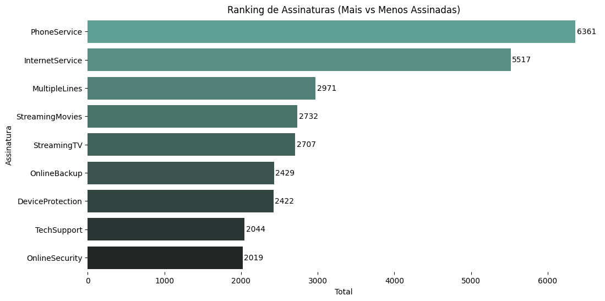
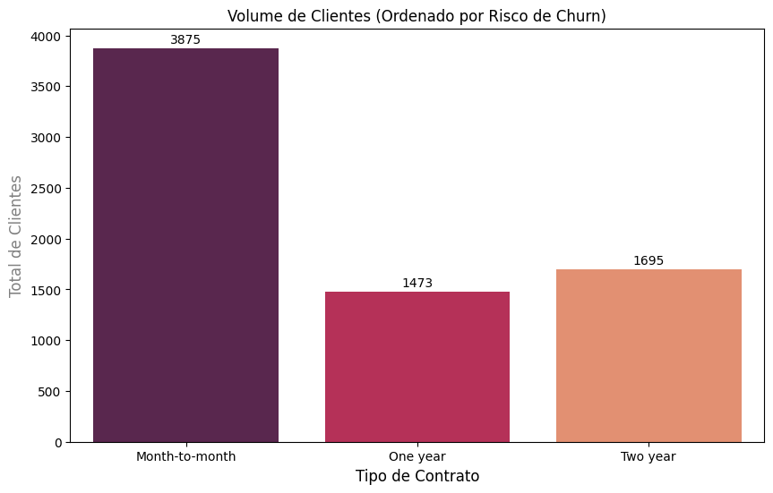
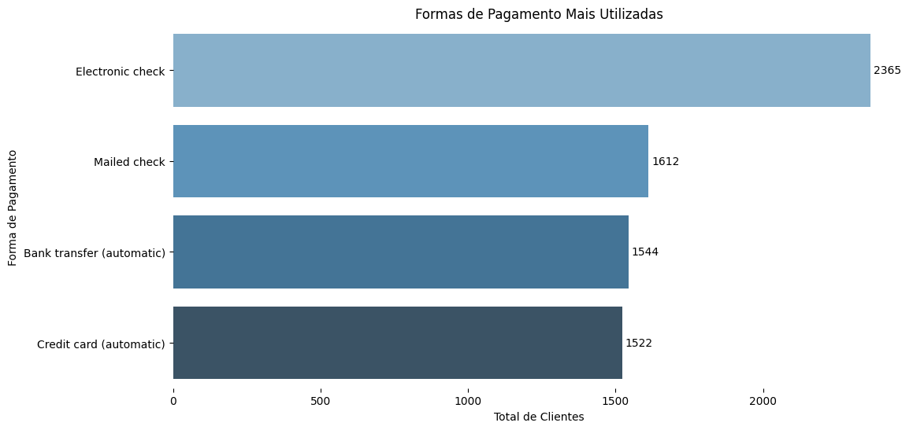
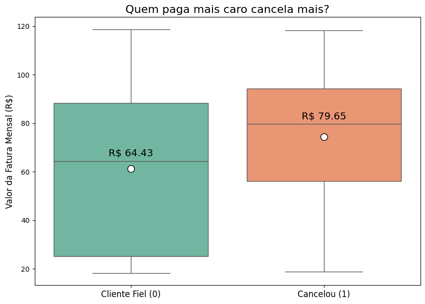
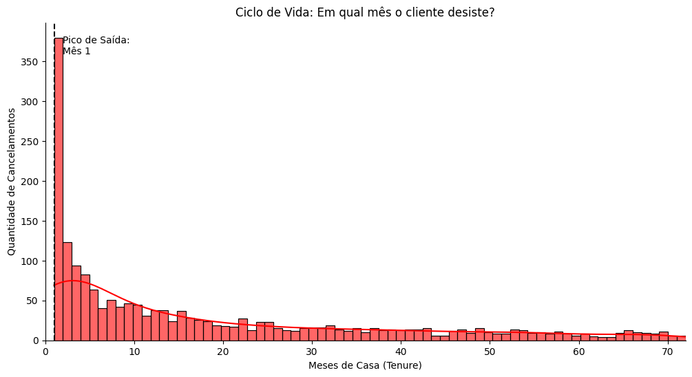
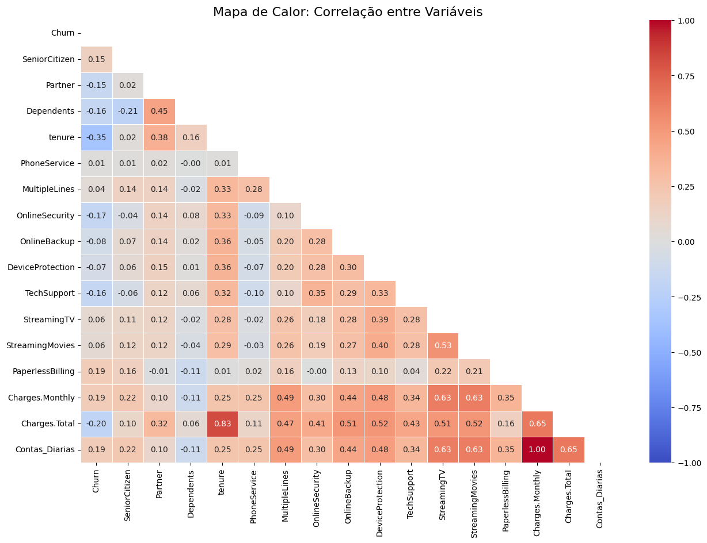

## 1. Introdução
O objetivo deste projeto é analisar o comportamento dos clientes da **Telecom X** para identificar os principais fatores que levam ao **Churn** (cancelamento de contrato). A evasão de clientes impacta diretamente a receita recorrente, e entender os padrões de saída é crucial para desenvolver estratégias de retenção eficazes.

## 2. Limpeza e Tratamento de Dados
Para garantir a qualidade da análise, foram realizadas as seguintes etapas de engenharia de dados:
* **Extração e Normalização:** Os dados originais estavam em formato JSON aninhado. Foi utilizado o `json_normalize` para tabular as informações de *customer*, *phone*, *internet* e *account*.
* **Tratamento de Tipos:** A coluna `Charges.Total` foi convertida para numérica, tratando valores vazios como zero.
* **Mapeamento Binário:** Variáveis categóricas (Yes/No) foram convertidas para numéricas (1/0) para facilitar a análise estatística.
* **Feature Engineering:** Criação da variável `Contas_Diarias` para entender o impacto do custo diário no orçamento do cliente.
* **Integridade:** Verificação e remoção de dados duplicados e inconsistentes.

## 3. Análise Exploratória de Dados (EDA)
Através de visualizações gráficas e estatísticas, identificamos os seguintes comportamentos:

### 3.1 Perfil de Serviços
* **Internet:** A fibra ótica é um dos mais populares, mas clientes com esse serviço tendem a ter tickets mais altos e maior taxa de cancelamento.
* **Telefonia:** É o serviço base da maioria dos contratos, com menor variação de churn isoladamente.

### 3.2 Fatores Contratuais e Financeiros
* **Tipo de Contrato:** Existe uma discrepância massiva no Churn baseada no contrato. Clientes com contratos **mensais (Month-to-month)** são extremamente voláteis, enquanto contratos de 1 ou 2 anos fidelizam o cliente quase totalmente.

* **Meio de Pagamento:** Clientes que utilizam **Electronic Check** possuem uma taxa de evasão significativamente maior do que aqueles que usam cartão de crédito ou débito automático.

### 3.3 Sensibilidade ao Preço
* **Ticket Médio:** O Boxplot revelou que **quem cancela paga mais caro**. A mediana da fatura mensal dos clientes que deram Churn é visivelmente superior à dos clientes fiéis, indicando alta sensibilidade a preço.

### 3.4 Ciclo de Vida (Tenure)
* **O "Vale da Morte":** A análise de histograma mostrou que o momento mais crítico é o **primeiro mês**. A maior parte dos cancelamentos ocorre logo no início do relacionamento (Mês 1 a 5), indicando problemas na experiência de *onboarding* ou venda errada.

### 3.5 Análise de Correlação (Heatmap)
A matriz de correlação validou matematicamente as hipóteses visuais:
* **Correlação Negativa Forte (Tenure vs Churn):** A variável `tenure` (tempo de casa) apresentou correlação inversa com o Churn. Quanto maior o tempo de contrato, menor a probabilidade de saída.
* **Correlação Positiva (Monthly Charges vs Churn):** A variável `MonthlyCharges` apresentou correlação positiva, confirmando estatisticamente que faturas mais altas pressionam o cancelamento.

## 4. Conclusões e Insights
Os dados apontam que o Churn na Telecom X não é aleatório, mas motivado por uma combinação de **flexibilidade contratual**, **alto custo** e **baixa percepção de valor inicial**.

1.  **Risco Imediato:** O cliente está em perigo máximo nos primeiros 6 meses. Sobreviver a este período aumenta drasticamente a retenção (LTV).
2.  **Preço x Benefício:** Clientes com pacotes caros (Fibra + Streaming) estão saindo mais, sugerindo que o serviço pode não estar entregando o valor percebido pelo preço cobrado.
3.  **Facilidade de Saída:** O contrato mensal facilita a evasão imediata diante de qualquer insatisfação.

## 5. Recomendações Estratégicas

Com base nos dados, sugerimos as seguintes ações:

1.  **Blindagem do 1º Mês (Onboarding):** Implementar um contato pró-ativo de "Boas-vindas" e suporte técnico dedicado nos primeiros 30 dias para garantir que o serviço esteja funcionando perfeitamente.
2.  **Migração Contratual:** Criar incentivos agressivos (descontos na fatura ou upgrade de velocidade) para clientes "Month-to-month" migrarem para contratos de **1 ano**.
3.  **Investigação do Electronic Check:** Auditar o processo de pagamento via cheque eletrônico para entender se há falhas técnicas ou de usabilidade que geram churn involuntário.
4.  **Estratégia de Downsell:** Para clientes de alto ticket (`MonthlyCharges` elevado) que solicitarem cancelamento, oferecer pacotes mais básicos antes de aceitar a perda total.

---
**Autor:** Matheus Brito  
*Analista de Dados*
